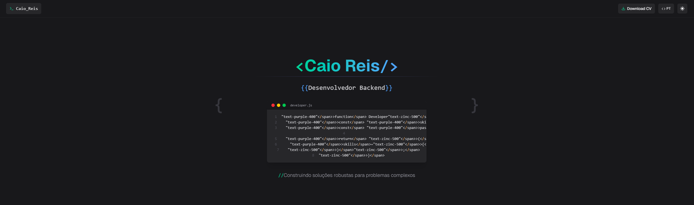

# Caio Reis - Portfolio Website



A modern, responsive developer portfolio website built with Next.js, TypeScript, Tailwind CSS, and Framer Motion.

## 🇺🇸 English

### Overview

This portfolio website showcases my skills, projects, and professional experience as a Backend Developer. It features a dark/light theme toggle, language switching (English/Portuguese), smooth animations, and dynamic GitHub project integration.

### Technologies

- **Framework**: [Next.js 14](https://nextjs.org/) (App Router)
- **Language**: [TypeScript](https://www.typescriptlang.org/)
- **Styling**: [Tailwind CSS](https://tailwindcss.com/)
- **Animations**: [Framer Motion](https://www.framer.com/motion/)
- **Icons**: [React Icons](https://react-icons.github.io/react-icons/)
- **Deployment**: [Vercel](https://vercel.com/)
- **Analytics**: Vercel Analytics
- **SEO**: Next.js Metadata API

### Features

- 🌓 Dark/Light Theme (automatically detects system preference)
- 🌐 Multilingual support (English/Portuguese)
- 📱 Fully responsive design
- ⚡ Optimized performance with Next.js
- 🔄 Dynamic GitHub repository integration
- 🎬 Smooth page transitions and animations
- 🧩 Terminal-inspired UI components
- 📊 Dynamic statistics visualizations
- 🤖 Structured data for improved SEO

### Project Structure

This is a [Next.js](https://nextjs.org) project bootstrapped with [`create-next-app`](https://nextjs.org/docs/app/api-reference/cli/create-next-app).

## Getting Started

First, run the development server:

```bash
npm run dev
# or
yarn dev
# or
pnpm dev
# or
bun dev
```

Open [http://localhost:3000](http://localhost:3000) with your browser to see the result.

You can start editing the page by modifying `app/page.tsx`. The page auto-updates as you edit the file.

This project uses [`next/font`](https://nextjs.org/docs/app/building-your-application/optimizing/fonts) to automatically optimize and load [Geist](https://vercel.com/font), a new font family for Vercel.

## Learn More

To learn more about Next.js, take a look at the following resources:

- [Next.js Documentation](https://nextjs.org/docs) - learn about Next.js features and API.
- [Learn Next.js](https://nextjs.org/learn) - an interactive Next.js tutorial.

You can check out [the Next.js GitHub repository](https://github.com/vercel/next.js) - your feedback and contributions are welcome!

## Deploy on Vercel

The easiest way to deploy your Next.js app is to use the [Vercel Platform](https://vercel.com/new?utm_medium=default-template&filter=next.js&utm_source=create-next-app&utm_campaign=create-next-app-readme) from the creators of Next.js.

Check out our [Next.js deployment documentation](https://nextjs.org/docs/app/building-your-application/deploying) for more details.
